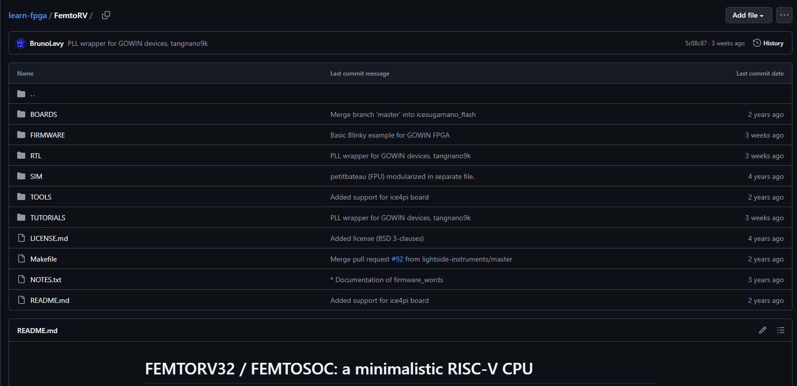
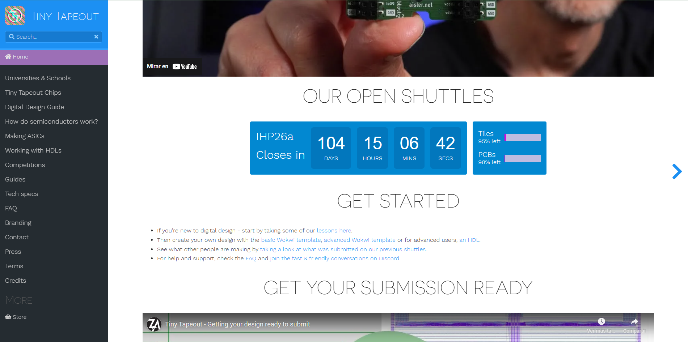
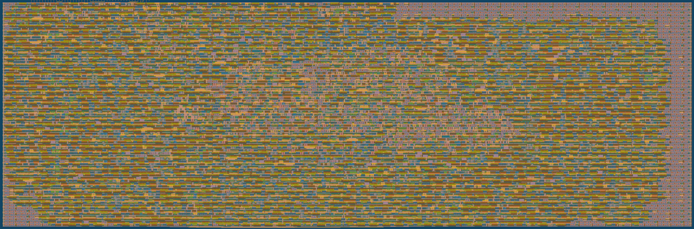

# Tecnicas avanzadas de digital Jean Carlos Tascon

## Resumen
En este repositorio mostraremos el procesó y procedimientos hechos para la clase Técnicas avanzadas de digitales, el objetivo de esta clase es crear un chip físico funcional basándose en los diseños de Bruno Levy sobre procesadores eb fpga específicamente el RISC-V FemtoRV, su trabajo se encuentra en siguiente link https://github.com/BrunoLevy/learn-fpga/tree/master,

En el desarrollo de los núcleos RISC-V FemtoRV, el diseño comienza con una descripción compartmental, donde se define cómo debe funcionar el procesador según la ISA. Luego se escribe la descripción RTL en Verilog, especificando el datapath, la ALU, el control y los registros. Esa RTL se somete a verificación funcional para comprobar que cada instrucción y cada módulo operen correctamente en simulación. Después, la RTL se convierte mediante síntesis lógica en una red de puertas optimizada, generando el gate-level netlist. Finalmente, se realiza la verificación y prueba a nivel de puertas, asegurando que el diseño sintetizado del FemtoRV mantenga el mismo comportamiento que el definido en RTL.

### Programas y dependencias
Las aplicaciones, archivos, programas y dependencias para el desarrollo del curso se encuentran en el siguiente link https://github.com/cicamargoba/VLSI/tree/main los programas usados son los siguientes con sus respectivas funciones en el proyecto

1. Yosys

Framework de síntesis Verilog-RTL con soporte para Verilog-2005.
Permite convertir código RTL en netlists lógicas optimizadas.

2. Icarus Verilog

Compilador y simulador de Verilog usado para verificación funcional.
Genera netlists y soporta estándares modernos de Verilog.

3. GTKWave

Visualizador de formas de onda (waveforms).
Permite analizar archivos VCD, FST y LXT generados por simulaciones HDL.

4. ngspice/ Xyce

Simulador SPICE para análisis de circuitos analógicos, digitales y mixtos.
Útil para validar comportamiento eléctrico y transitorios.

5. OpenSTA

Herramienta de análisis de timing estático (Static Timing Analysis).
Evalúa tiempos de propagación, restricciones y cumplimiento de timing post-síntesis.

6. Magic VLSI

Editor para diseño físico (layout) de circuitos integrados.
Permite visualizar, editar y verificar capas físicas en procesos CMOS (ej. SKY130).

7. OpenLane

Flujo automatizado de diseño digital RTL → GDSII.
Integra herramientas como Yosys, OpenROAD, Magic y KLayout para generar un chip completo.

## Tinytapeout

Para la fabricación del chip utilizaremos la plataforma de TinyTapeout, un proyecto educativo y colaborativo que permite implementar diseños digitales en un proceso real de fabricación CMOS. TinyTapeout integra un flujo completo desde la descripción RTL en Verilog hasta la generación del layout final en GDSII, utilizando herramientas abiertas como Yosys para síntesis, OpenLane para el flujo físico y Magic para verificación. La plataforma agrupa múltiples diseños de distintos participantes en un solo chip mediante multi-project wafers (MPW), lo que reduce significativamente los costos de fabricación. Cada proyecto recibe un área definida y un entorno de pruebas estandarizado, permitiendo validar el funcionamiento del circuito ya fabricado. Gracias a este flujo accesible, es posible llevar un diseño académico o experimental desde su concepción lógica hasta un circuito integrado manufacturado en tecnología SKY130 de libre acceso.

Mediante tinytapeout y sus plantillas de verylog obtenermos la construccion de los siguientes chips el primero es un procesador con modulos de comucinacion uart y spi.

El otro es un multiplicador de 4 bits con una salida de 8 bits.

Las simulaciones en gktway son las siguiente: